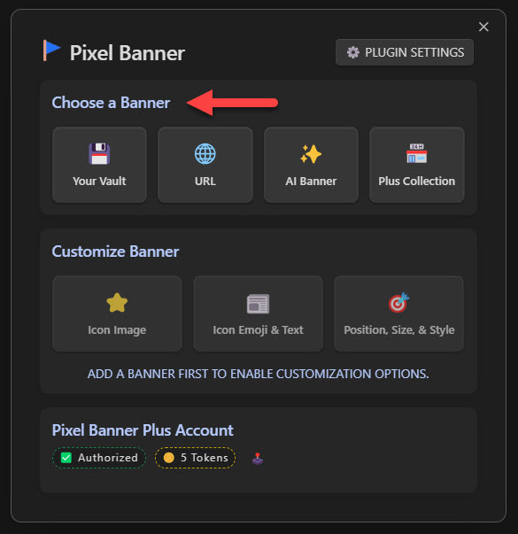
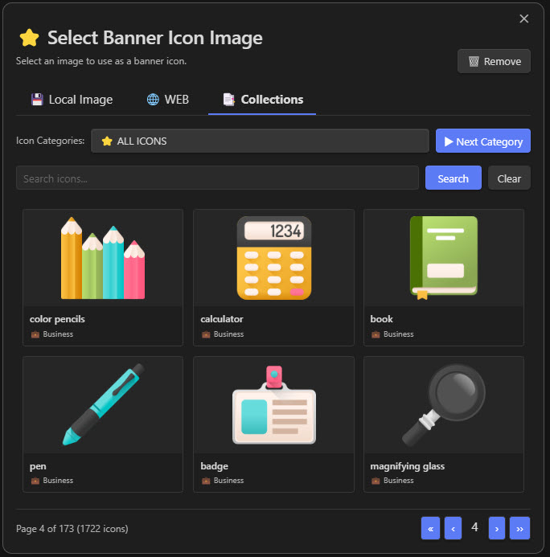
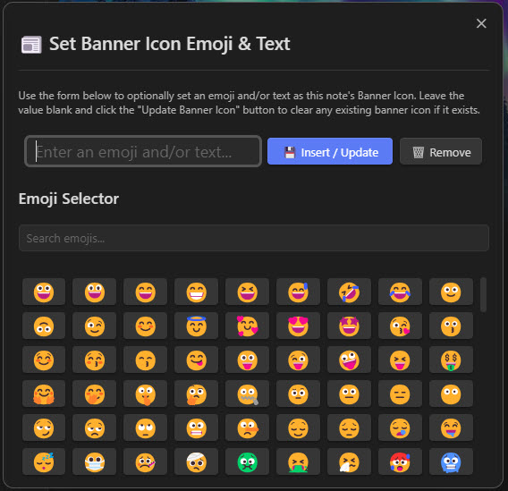
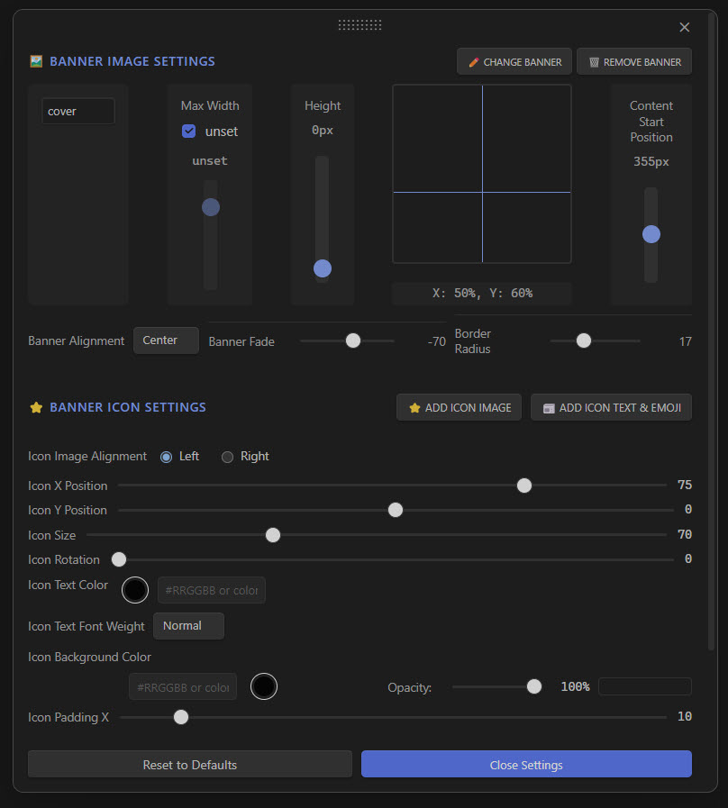

# 🚩 Pixel Banner for Obsidian

Pixel Banner is a powerful Obsidian plugin that transforms your notes with customizable banner images, creating visually stunning headers that enhance your knowledge workspace. Go beyond simple note-taking with banners that provide visual context and improved aesthetics.

### Maintained by

 

## Key Features

### Smart Banner Creation
- AI-Generated Banners: Create stunning, custom banners using AI generation without design skills
- Banner Store: Browse and use professional banner images from the integrated store, including free options
- Local Image Support: Use images from your vault as banners with advanced customization options
- Direct URL Banners: Apply banners from any web URL for maximum flexibility
- Note Properties Integration: Control all banner aspects through Obsidian's properties feature

### Visual Customization
- Position Control: Fine-tune banner placement with precise vertical and horizontal positioning for perfect alignment
- Appearance Options: Customize transparency, border radius, animation effects, and spacing for seamless integration
- Display Flexibility: Choose between display modes (cover, auto, contain) with options for repetition and sizing
- Banner Icons: Add and customize decorative icons with control over size, position, color, background, and style
- Title Integration: Style inline titles with custom colors that complement your banner designs

### Efficient Workflow
- Banner Selection Modal: Quick visual picker for local images with sorting options
- Command Integration: Access all banner functions via command palette and hotkeys
- Quick Action Icons: Select, pin, refresh, and view banners with convenient UI controls
- Custom Field Names: Rename any banner property field to fit your workflow

### Smart Organization
- Folder-Specific Settings: Configure default banner behavior per folder
- Image Shuffling: Automatically rotate through images in specified folders
- Direct Children Option: Apply settings only to immediate folder contents

### Premium Features (Pixel Banner Plus)
- Token-Based System: Generate AI banners with a flexible pay-as-you-go model
- Banner History: Access your previously generated banners
- Prompt Inspiration: Get AI assistance with banner ideas
- No Subscription Required: Purchase tokens only when needed

Enhance your Obsidian experience with beautiful, intelligent banners that make your notes visually distinctive and organized. Whether you prefer AI-generated art, professional designs from the store, or your own images, Pixel Banner helps create a visually cohesive knowledge base.

## Installation

1. Open Obsidian and go to Settings
2. Navigate to Community Plugins and disable Safe Mode
3. Click on Browse and search for "Pixel Banner"
4. Install the plugin and enable it

## Basic Workflow

1. Open a note and click the `Banner Flag` in the top left corner of your Note  

    

2. Select a `Source` for your Banner (the AI and Store options require you to first create a FREE Pixel Banner Plus account at: https://pixel-banner.online)  

    

3. _Optionally_ select `Banner Icon` text (this can be any text, but it is advised to use an Emoji 🤣)

    

4. _Optionally_ change the `postion`, `size`, `color`, and various other `properites` for both the `Banner Image` and `Banner Icon` of the note (by default they will inherit the General settings in Pixel Banner's main setting page, but are customizable per note)

    

5. Click the `Banner Flag` icon anytime to adjust any of these settings (`Banner Image`, `Banner icon`, `Display Properties`)

    

### 🎉 Happy Pixel Bannering 🤣

---

## Appreciation
If you enjoy `Pixel Banner` please consider sending me a tip to support my work 😀
# [🍵 tip me here](https://ko-fi.com/jparkerweb)
Any `ko-fi` donator automatically recieves free `Tokens` to spend in Pixel Banner Plus!

## Feedback and Support

If you encounter any issues or have suggestions for improvements, please [open an issue](https://github.com/jparkerweb/pixel-banner/issues) on the GitHub repository.
